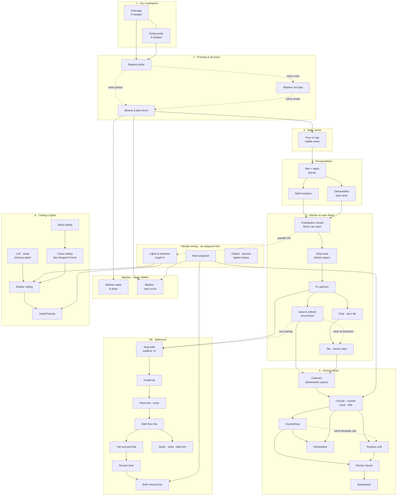
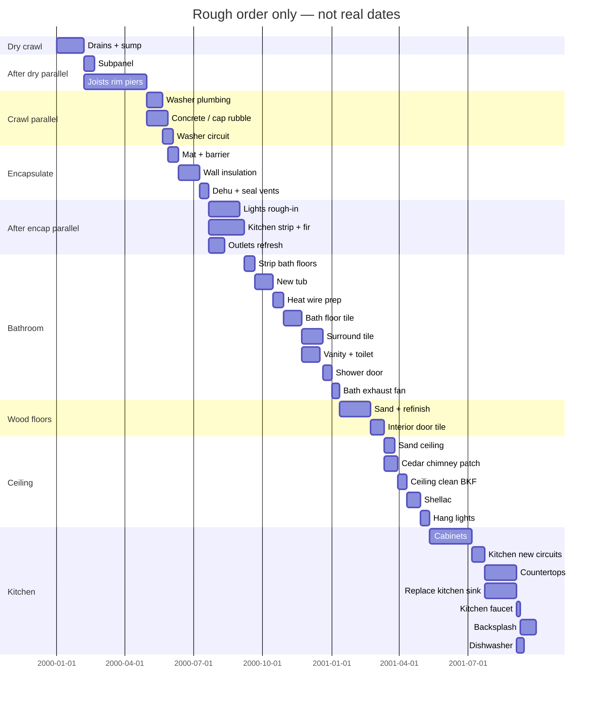

# Cabin remodel — task map (Mermaid)

**If the diagrams below show as code blocks:** Cursor’s default Markdown preview does not run Mermaid. Use either:

1. Install the extension **Markdown Preview Mermaid Support** (or **Mermaid Preview**), then open Markdown preview, or  
2. Open **`index.html`** in your browser. On the live page you can **tap any flowchart box or Gantt label/bar** for scope notes, or use the **task list** at the bottom (good on phones).

The flowchart uses **line breaks** in labels (` `). If preview strips them, open the HTML file or set Mermaid `securityLevel: loose` in your preview settings.

---

## Flowchart

## Gantt (illustrative only)

Same **dependencies** as the flowchart. **Not a calendar commitment:** dummy start `2000-01-01`; **ignore axis dates**. **Bar lengths** are rough relative effort. Where tasks share the same **`after`** predecessor, Mermaid draws them **in parallel** (stacked)—that is “allowed overlap,” not a promise you will staff it that way.

**Gantt notes:** **Subpanel** before bath fan. **Countertops** and **sink replace** share the same window (parallel after kitchen circuits); **faucet** after both; **backsplash** after faucet. Parallel tracks elsewhere: subpanel vs structure after dry; washer plumbing vs concrete; after encapsulation, lights rough-in + kitchen strip + outlets; after bath floor tile, surround vs vanity; fan after shower door + subpanel; after door tile, ceiling sand vs cedar patch; backsplash vs dishwasher after counters (DW can stay after counter only). Hired trades shorten **sp**, **wcirc**, **k_elec**. Multi-`after` needs a current Mermaid build.

## Grouping summary

| Group | Purpose |
|--------|--------|
| **1 Dry** | Stops moisture that rots wood and undermines encapsulation. |
| **2 Structure** | Joists, rim, beams/piers — same phase, often sequenced by access. |
| **2U Washer rough** | After **all crawlspace structural wood**: washer **sewer + supply** plumbing; **new washer circuit** needs **subpanel replaced** and wood work done. |
| **3 Rough areas** | Only if you need a stable surface before mat/plastic. |
| **4 Encapsulation** | Barrier, insulation, conditioning. |
| **5 Floors general** | Kitchen strip, fir, refinish, **interior door tile inside only** (feeds bath and kitchen). |
| **5B Bathroom** | Strip → tub → heat prep → floor tile → surround → shower door → **exhaust fan** (**subpanel** must be **done before** fan power). Vanity/toilet/trim can run parallel with surround from floor tile. |
| **6 Kitchen** | Cabinets → **kitchen circuits** (subpanel first). **Countertops** and **sink replacement** in the **same install window** (coordinate with fabricator). **Faucet** after counter + sink. **Backsplash** after faucet. **Dishwasher** after countertop (and circuits). |
| **8 Ceiling** | **Loft cedar** before shellac; sand → BKF → shellac; **install lights** after shellac **and** after rough-in complete. |
| **9 Anytime** | **Subpanel first** among these when you add circuits (**fan**, washer, kitchen). Then **light/switch rough-in** (no subpanel for that rough-in alone) and **outlets**. **Installing** lights waits on rough-in + shellac; **washer circuit** needs subpanel + crawl wood; **kitchen circuits** before backsplash/dishwasher. |

Adjust links into **K1** if kitchen cabinets must sit on tile vs refinished wood.
